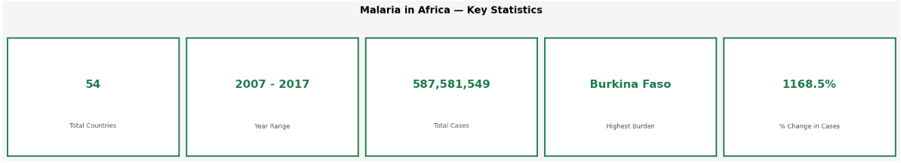
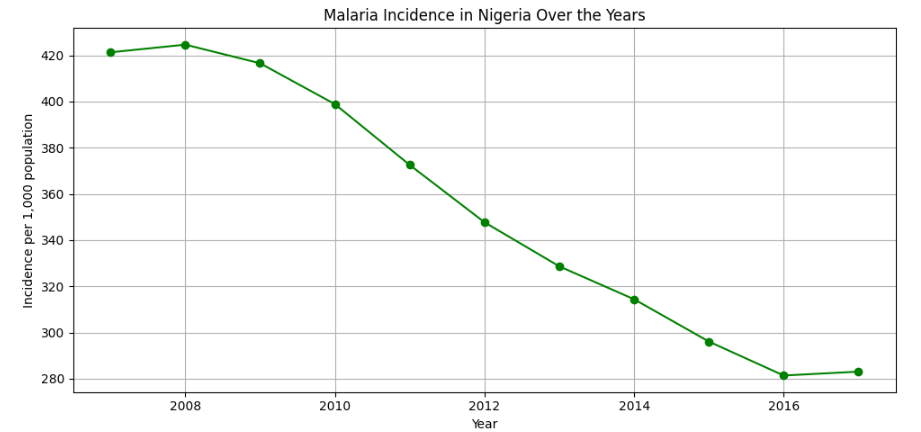
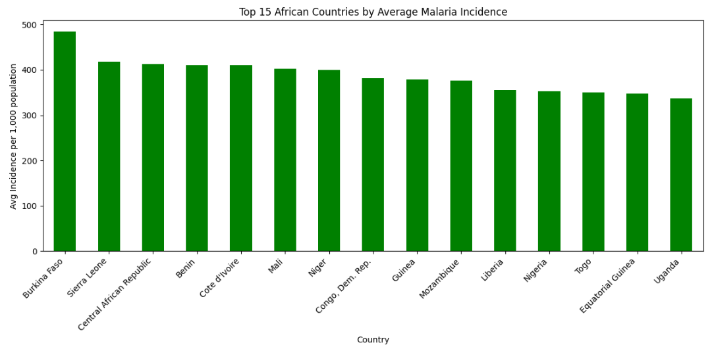
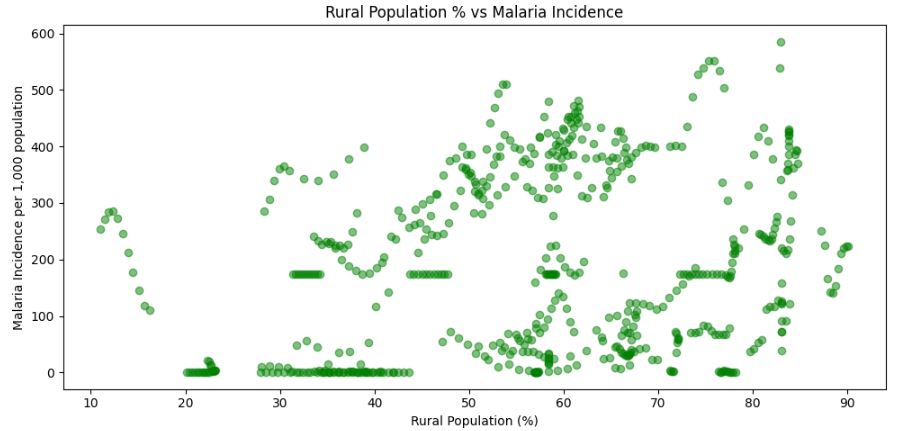
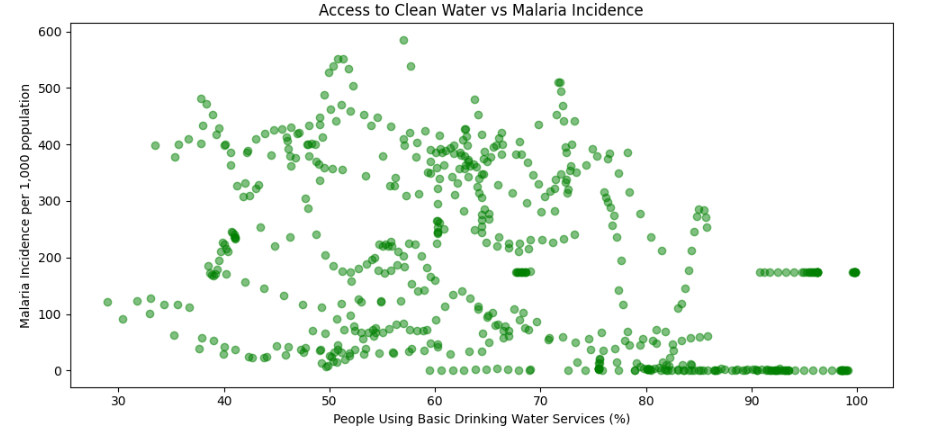
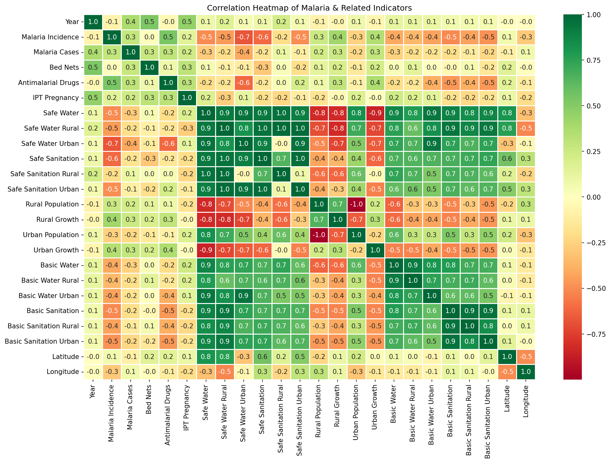

# 🦟 Malaria in Africa: Exploratory Data Analysis

> Uncovering malaria trends, geographic patterns, and public health correlations across Africa using Python.

---

## 📌 Project Overview

This project performs an end-to-end exploratory data analysis on malaria trends across African countries, focusing on incidence patterns, prevention indicators, and the relationship between infrastructure access and malaria burden.

**Dataset:** [Malaria in Africa](https://www.kaggle.com/datasets/vicokafor/malaria-in-africa) — Kaggle
**Notebook:** [View on Kaggle](https://www.kaggle.com/code/vicokafor/malaria-in-africa-eda)
**Status:** ✅ Completed

---

## 🛠️ Tech Stack

| Tool | Purpose |
|------|---------|
| Python | Core analysis |
| Pandas | Data manipulation |
| Matplotlib | Visualizations |
| Seaborn | Correlation heatmap |

---

## 📈 Key Findings

| # | Finding |
|---|---------|
| 1 | Nigeria recorded a **34% reduction** in malaria incidence between 2008 and 2017 |
| 2 | **Burkina Faso** has the highest average malaria incidence in Africa |
| 3 | Rural populations show a weak positive correlation (**+0.3**) with malaria incidence |
| 4 | Access to clean water shows a moderate negative correlation (**-0.5**) with malaria |
| 5 | Infrastructure access is a stronger driver of malaria burden than location alone |

---

## 📊 Dashboard Preview

---

## 🗂️ Repository Structure
malaria-in-africa-eda/
│
├── Malaria_in_Africa_EDA.ipynb    # Full Python notebook
├── nigeria_trend.png               # Nigeria malaria trend chart
├── kpi_cards.png                   # KPI dashboard
├── continental_comparison.png       # Top 15 countries comparison
├── rural_vs_malaria.png             # Rural population vs malaria
├── water_vs_malaria.png            # Water accessibility vs malaria
├── heatmap.png                     # Correlation heatmap
└── README.md
---

## 💡 Recommendations

1. **Invest in clean water infrastructure** — strongest correlation with reduced malaria
2. **Focus on rural healthcare** — rural areas carry the highest burden
3. **Scale up bed net distribution** — particularly in West Africa
4. **Sustain Nigeria's progress** — interventions are working
5. **Regional collaboration** — West and Central Africa should share strategies

---

## 📫 Connect With Me

- 💼 [LinkedIn](https://www.linkedin.com/in/victoria-okafor-4720a02b8)
- 🐙 [GitHub](https://github.com/vicokafor)
- 📊 [Kaggle](https://www.kaggle.com/vicokafor)
